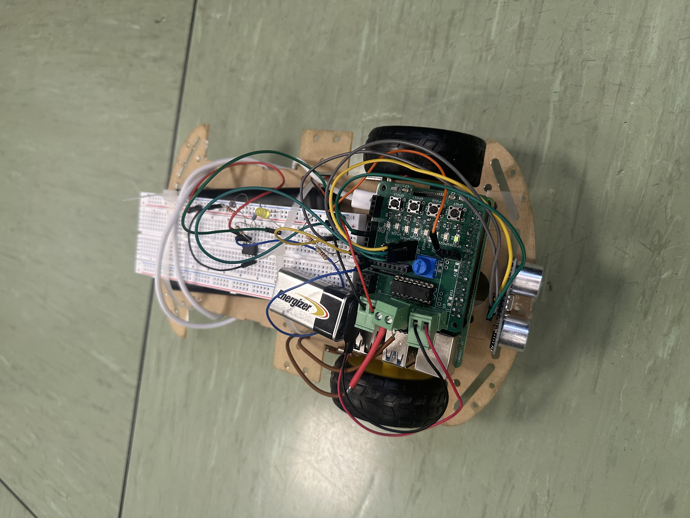
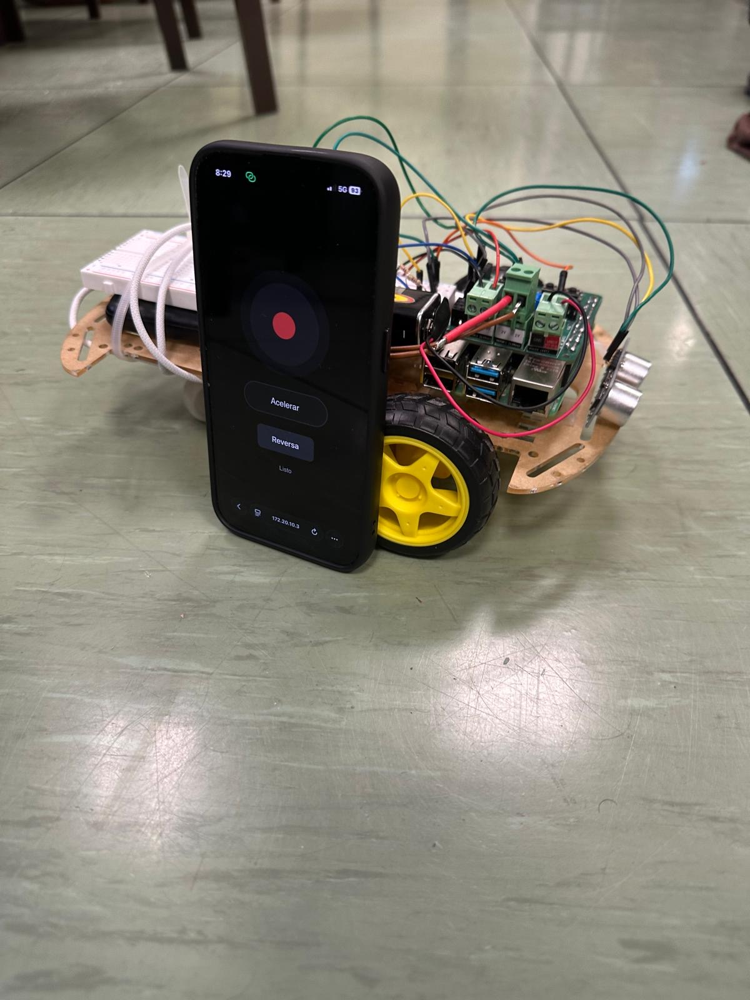

# 🚗 Raspberry Pi 3 RC Car

<p align="center">
  
  
  
  
</p>

<p align="center">
  A three-wheeled robot car controlled from any phone browser over Wi-Fi, built on a
  <strong>Raspberry Pi 3</strong> and programmed entirely in <strong>Python</strong>.
  Features real-time obstacle avoidance with an <strong>HC-SR04</strong> ultrasonic sensor,
  automatic LED brightness via an <strong>LDR</strong> and <strong>MCP3008 ADC</strong>,
  hardware PWM motor control, and a touch-friendly joystick web interface.
</p>

---

## 📸 Gallery

<p align="center">
  
  &nbsp;&nbsp;
  
</p>

<p align="center">
  <em>Left: top-down view showing the RPi 3, motor driver, breadboard, HC-SR04 and LDR circuit.
  Right: the mobile web joystick used to drive and steer the car.</em>
</p>

---

## ✨ Features

- **Mobile web controller** — touch joystick + accelerate button + reverse toggle, served directly from the Pi over Wi-Fi (no app install needed)
- **Obstacle avoidance** — HC-SR04 ultrasonic sensor progressively caps forward speed as the car approaches an obstacle; full stop at < 8 cm
- **Automatic LED** — LDR reads ambient light via MCP3008 ADC; LED dims in daylight and brightens in darkness
- **Hardware PWM** — smooth, jitter-free motor speed control using the Raspberry Pi's true hardware PWM channels
- **Differential steering** — independent left/right wheel speed model for smooth turning
- **Fail-safe** — if the browser connection is lost for > 0.5 s, the car stops automatically
- **Clean shutdown** — Ctrl+C stops motors and releases GPIO resources gracefully

---

## 🛠️ Hardware

### Bill of Materials

| Component | Model / Notes | Qty |
|-----------|---------------|-----|
| Single-board computer | Raspberry Pi 3 Model B / B+ | 1 |
| Motor driver | L298N dual H-bridge | 1 |
| DC gear motors | 6 V TT motors (yellow/black) | 2 |
| Wheels | Compatible with TT motor shaft | 2 |
| Ultrasonic sensor | HC-SR04 | 1 |
| ADC | MCP3008 (10-bit, SPI) | 1 |
| Light sensor | LDR (photoresistor) + 10 kΩ resistor (voltage divider) | 1 |
| LED | Any colour + current-limiting resistor (~220 Ω) | 1 |
| Power supply | 4× AA batteries (6 V) for motors; USB power bank for Pi | 1 each |
| Chassis | Laser-cut wood 2WD platform | 1 |
| Breadboard | Full-size | 1 |
| Jumper wires | Male–male and male–female | assorted |

### GPIO Wiring

> All pin numbers use **BCM (Broadcom)** numbering — this is what gpiozero and RPi.GPIO use by default.

#### Motor driver (L298N)

| Signal | BCM GPIO | Physical Pin | Notes |
|--------|----------|--------------|-------|
| Left motor IN1 | 4 | 7 | Direction control |
| Left motor IN2 | 5 | 29 | Direction control |
| Right motor IN1 | 6 | 31 | Direction control |
| Right motor IN2 | 12 | 32 | Direction control |
| Left motor ENA (PWM) | **18** | 12 | Hardware PWM channel 0 |
| Right motor ENB (PWM) | **19** | 35 | Hardware PWM channel 1 |

#### Ultrasonic sensor (HC-SR04)

| Signal | BCM GPIO | Physical Pin |
|--------|----------|--------------|
| TRIG | 20 | 38 |
| ECHO | 21 | 40 |

> ⚠️ The HC-SR04 ECHO pin outputs 5 V. Use a voltage divider (1 kΩ + 2 kΩ) to bring it down to ~3.3 V before connecting to the Pi.

#### ADC & light sensor (MCP3008 + LDR)

The MCP3008 connects to the Pi's hardware SPI bus (SPI0):

| MCP3008 Pin | Raspberry Pi (BCM) | Physical Pin |
|-------------|-------------------|--------------|
| VDD, VREF | 3.3 V | 1 |
| AGND, DGND | GND | 6 |
| CLK | 11 (SCLK) | 23 |
| DOUT (MISO) | 9 | 21 |
| DIN (MOSI) | 10 | 19 |
| CS/SHDN | 8 (CE0) | 24 |
| CH0 | — | LDR voltage divider output |

#### LED

| Signal | BCM GPIO | Physical Pin |
|--------|----------|--------------|
| LED anode (+ resistor) | 25 | 22 |
| LED cathode | GND | any GND |

---

## 📁 Project Structure

```
raspberry-pi-car/
├── images/
│   ├── car_top_view.jpg
│   └── car_with_web_controller.jpg
├── src/
│   ├── main.py            # Entry point — 50 Hz control loop
│   ├── car.py             # Car class (motors + LED + LDR via ADC)
│   ├── constants.py       # All hardware config and tuning parameters
│   ├── ultrasonic.py      # HC-SR04 sensor driver
│   └── web_controller.py  # Flask server + mobile joystick UI
├── .gitignore
├── LICENSE
├── README.md
└── requirements.txt
```

---

## ⚙️ Installation

### 1. Prerequisites

- Raspberry Pi 3 running **Raspberry Pi OS** (Bullseye or later, 32/64-bit)
- Python **3.11+** (`python3 --version`)
- The Pi and your phone must be on the **same Wi-Fi network**

### 2. Enable hardware interfaces

#### Hardware PWM
Add the following line to `/boot/config.txt` (or `/boot/firmware/config.txt` on newer OS versions):

```
dtoverlay=pwm-2chan
```

Then reboot: `sudo reboot`

#### SPI (for MCP3008)
```bash
sudo raspi-config
# → Interface Options → SPI → Enable → Finish
```

### 3. Clone the repository

```bash
git clone https://github.com/<YOUR_USERNAME>/raspberry-pi-car.git
cd raspberry-pi-car
```

### 4. Install Python dependencies

```bash
pip install -r requirements.txt
```

> If you get a permission error, use `pip install --break-system-packages -r requirements.txt` on newer Raspberry Pi OS versions.

---

## 🎮 Usage

### Start the car

```bash
python src/main.py
```

The terminal will print the server URL and live telemetry:

```
Web server started.
Open on your phone: http://<RASPBERRY_PI_IP>:8080

rev=False  dir=+0.00  acc=0.00  dist= 85.3 cm  light=1.92 V  led=0.00  L=0.00  R=0.00
```

### Control from your phone

1. Find the Pi's IP address: `hostname -I`
2. Open `http://<PI_IP>:8080` in your phone browser (Chrome / Safari)
3. Use the **joystick** to steer, hold **Accelerate** to go forward, tap **Reverse** to toggle reverse mode
4. Press **Ctrl+C** in the terminal to stop everything cleanly

---

## 🧠 How It Works

### Architecture

The project follows a clean single-responsibility module design:

```
main.py  ──reads──▶  web_controller.py   (Flask REST API + mobile UI)
         ──reads──▶  ultrasonic.py        (HC-SR04 distance measurement)
         ──uses ──▶  car.py               (motors + LED + LDR)
                         └──reads──▶  constants.py  (all config)
```

### Obstacle avoidance

The `PROXIMITY_TABLE_CM` in `constants.py` defines a piecewise-linear speed cap:

```
Distance  →  Max forward speed
≥ 100 cm  →  100 %
   60 cm  →   70 %
   25 cm  →   30 %
   15 cm  →   15 %
 ≤  8 cm  →    0 % (full stop)
```

The car's actual forward speed is `joystick_acceleration × speed_cap`, so it slows down gradually instead of braking suddenly. In **reverse**, the cap is disabled and speed is limited to `MAX_REVERSE_SPEED = 0.4`.

### Automatic LED

The LDR forms a voltage divider with a 10 kΩ resistor. As ambient light increases, LDR resistance decreases and the voltage at the MCP3008 input rises. The `compute_led_brightness()` method maps:

```
voltage ≥ 1.74 V  →  LED off   (bright environment)
voltage ≤ 0.50 V  →  LED full  (dark environment)
in between        →  linear interpolation
```

### Differential steering

`compute_wheel_speeds()` implements a simple differential-drive model: the outer wheel keeps the full base speed while the inner wheel is reduced by `|steering| × STEERING_GAIN`. This produces smooth, proportional turns without abrupt speed changes.

---

## 📌 Recommended GitHub Topics

Add these under **⚙ Settings → Topics** in your repository to maximise discoverability:

```
raspberry-pi  raspberry-pi-3  rc-car  robot  robotics  python
gpio  gpiozero  flask  hc-sr04  ultrasonic-sensor  ldr  mcp3008
l298n  hardware-pwm  embedded-systems  iot  mobile-controller
```

---

## 🎓 Academic Context

This project was developed as the final project for the *Electronic Systems* course
in the [Mathematical Engineering and Artificial Intelligence](https://www.comillas.edu/grados/grado-en-ingenieria-matematica-e-inteligencia-artificial-imat/)
degree (iMAT) at **Universidad Pontificia Comillas ICAI**, Madrid.

---

## 🚀 Future Improvements
- Autonomous navigation
- Computer vision using OpenCV
- Object detection with AI models
- Path planning algorithms
- ROS 2 integration

## 📄 License

This project is licensed under the [MIT License](LICENSE) — feel free to use,
modify, and distribute it with attribution.
